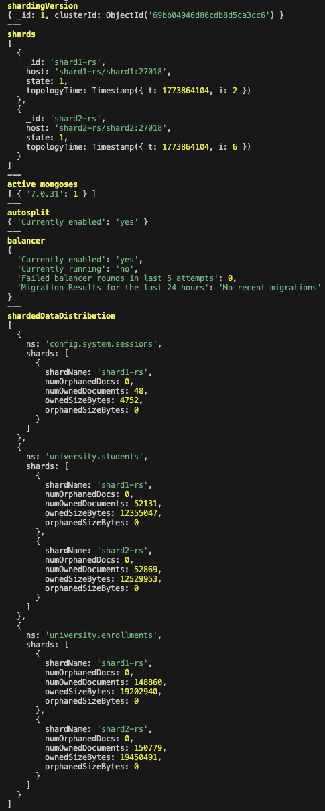
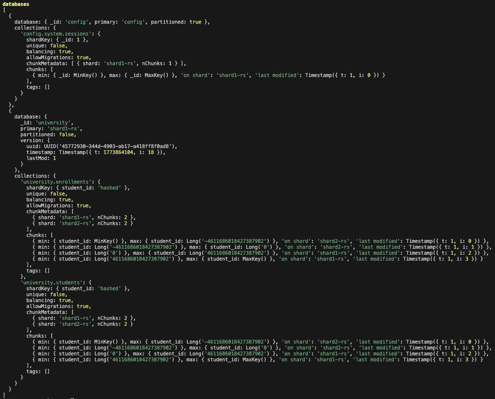
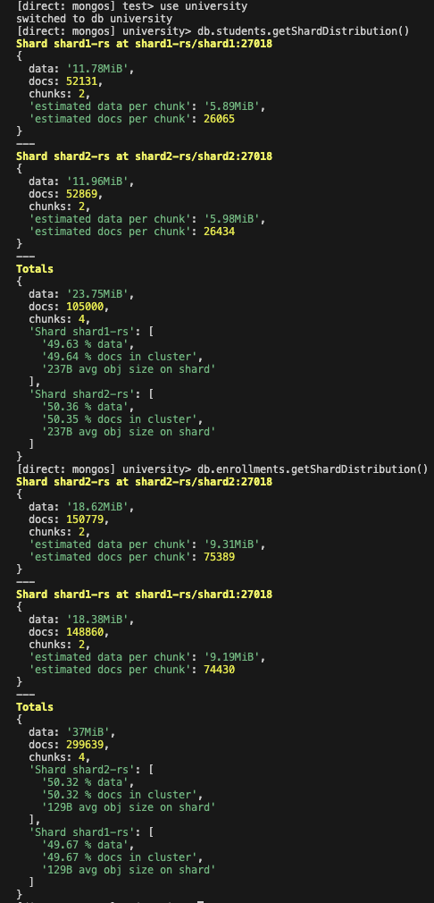
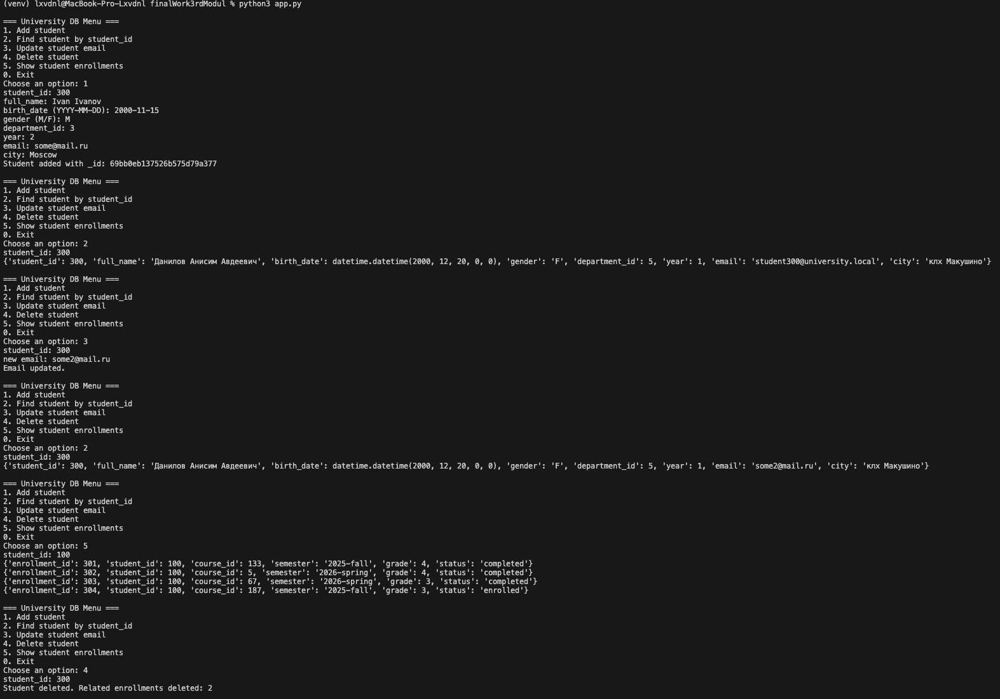
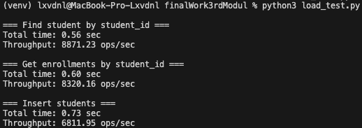

# Итоговое задание по модулю 3

## Нереляционные базы данных

## 1. Описание задачи

Цель работы — разработать нереляционную базу данных с шардингом, реализовать интерфейс на Python и провести нагрузочное тестирование.

## 2. Архитектура системы

Система развернута с использованием Docker Compose и включает:

- 3 конфигурационных сервера: `cfg1`, `cfg2`, `cfg3`;
- 2 шарда:
  - `shard1-rs`
  - `shard2-rs`;
- маршрутизатор запросов `mongos`.

Структура проекта:

- `docker-compose.yml` — описание и запуск всех сервисов кластера MongoDB
- `scripts/init-cluster.sh` — скрипт инициализации кластера и настройки шардинга
- `seed_data.py` — скрипт для генерации и заполнения базы тестовыми данными
- `app.py` — консольное приложение для работы с базой
- `load_test.py` — скрипт для проведения нагрузочного тестирования
- `venv/` — виртуальное окружение Python

## 3. Модель данных

Предметная область — университет.

Использованы следующие коллекции:

- `students`
- `enrollments`
- `courses`
- `teachers`
- `departments`

Пример документа из коллекции `students`:

```json
{
  "student_id": 100,
  "full_name": "Иван Иванов",
  "birth_date": "2004-03-10",
  "gender": "M",
  "department_id": 1,
  "year": 2,
  "email": "some@mail.ru",
  "city": "Moscow"
}
```

Связь между студентами и курсами реализована через коллекцию enrollments.

## 4. Реализация шардинга

В качестве ключа шардинга выбран:

student_id (hashed)

Причины выбора:

- равномерное распределение данных по шардам;
- отсутствие перегрузки отдельных узлов;
- высокая эффективность точечных запросов.

Шардинг был включен для коллекций:

- students
- enrollments





## 5. Распределение данных

После заполнения базы было получено следующее распределение:

- shard1: ~49.6%
- shard2: ~50.4%

Вывод:

Распределение данных является равномерным, что подтверждает корректность выбора shard key



## 6. Реализация интерфейса на Python

Реализовано консольное приложение, позволяющее выполнять основные операции:

- добавление студента
- поиск студента по student_id
- обновление email
- удаление студента
- получение списка записей (enrollments)



## 7. Наполнение базы данных

База данных была автоматически заполнена с помощью Python скрипта

Объем данных:

- students: 100000 документов
- enrollments: 300000 документов
- courses: 200
- teachers: 100
- departments: 10

## 8. Нагрузочное тестирование

Для тестирования использовался Python скрипт с многопоточностью:

- количество потоков: 20
- количество запросов: 5000

Проверялись операции:

- поиск студента по student_id
- получение записей enrollments
- вставка новых студентов

Результаты:

| Операция | Время выполнения | Производительность |
|----------|----------------|-------------------|
| Поиск студента | 0.56 сек | 8871 ops/sec |
| Получение enrollments | 0.60 сек | 8320 ops/sec |
| Вставка данных | 0.73 сек | 6811 ops/sec |



## 9. Анализ результатов

- Использование hashed shard key обеспечило равномерное распределение данных
- Запросы по student_id выполняются быстро, так как направляются в конкретный шард
- Операции чтения и записи показывают высокую пропускную способность
- Система демонстрирует хорошую масштабируемость, так как данные равномерно распределяются между шардами и нагрузка не концентрируется на одном узле

## 10. Вывод

В ходе работы:

- разработана нереляционная база данных
- реализован шардинг
- создан интерфейс для работы с данными
- проведено нагрузочное тестирование
- выполнен анализ производительности

Полученная система демонстрирует:

- равномерное распределение данных
- высокую производительность
- возможность масштабирования